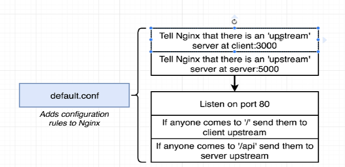
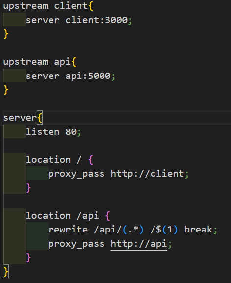

## Basics

# Docker vs VM
	Ans: VM is very heavy. It is running an entire OS on top of an OS.
    Docker isn't like that, it runs an application on top of the system. It doesn't include the kernel. It just requires the application, enough of conf and enough of OS layer to run it bare min. It uses and interact with host kernel whenever it is required to do something. Ex: copy commands that runs in the host and moves into the container, that is when docker interacts with host.

# Commands
1. docker pull <name>  - Pull any image
2. docker ps - Shows all images/containers
3. docker container prune - Removes all unused containers
4. docker volume ls - Lists all the volumes
5. docker container ls - Same as docker ps
6. docker run --name give-a-name -p your-any-port:default port of the container -d imagename
    Ex: docker run --name my-mongodb-one -p 4000:27017 -d mongo
    if you run the docker ps, you will see the default port of the image.
7. docker logs imagename or Docker logs CI
    Ex: Docker logs my-mongodb-one gives all the logs
8. docker run imagename -a
    -a -> attach to the container and watch the output coming from it and print it
9. docker start CID - Start a container
10. docker container stop CID - Stops the CID mentioned -> let the docker do shutdown on its own time and do a clean up
11. docker container kill CID - Stops the CID mentioned -> shutdown the process right now and no additional work.
12. docker logs CID - To get the logs
13. docker exec -it CID cmd - Execute an additional command in the terminal. They are actually 2 seperate tags. -i connects to stdin of the process and -t formats the terminal output.
14. docker exec -it CID sh - Full terminal access inside the contest of the container. You can give bash/sh/zsh/powershell (any command processer). This will allow us to type commands in and have them be executed inside the container.
15. docker build . - Gives our docker file to docker cli and it generates an image out of it. The dot refers to a build context that is the set of files and folders that we want to wrap inside this container.
16. docker run -p <port number>:<port number> <image id> - Route incoming requests to this port on local host to : this port inside the container
17. docker-compose up  -> equicvalent to docker run myimage
18. docker-compose up --build  -> equivalent to  docker build . + docker run myimage
19. docker-compose up -d  -> Launch in the background
20. docker-compose down  -> Stop containers
21. docker-compose ps -> it looks for a docker-compose file in your current dir and read it and finds the running containers on your local machine that essentially belong to this docker compose file.
22. docker build -f Dockerfile.dev .   --> when you run docker build . it checks for the Dockerfile, but when you have 2 versions like one for dev and one for prod then you have to mention the specific file with -f flag. It specifies which file you want to build.
    Ex: I have Dockerfile.dev, to build that I have to use "docker build -f Dockerfile.dev ." command.
23. docker run -p <port>:<port> -v /app/node_modules -v $(pwd):/app <image id>  -> command for docker volume without docker compose. To avoid running this big command, setup docker-compose file with context and dockerfile options inside build option like below

    - version: '3'
    - services:
        - web:
            - build: 
                - context: .
                - dockerfile: Dockerfile.dev
            - ports:
                - "3000:3000"
            - volumes:
                - /app/node_modules
                - .:/app

## How to write a Dockerfile
    - Step1: BaseImage
    - Step2: Install a software and configure that software
                COPY ./ ./   => Copy - Path to folder to copy from on your machine relative to build context - Place to copy stuff inside the container. Inshort, we will copy everything from our current working directory into the contianer.
                WORKDIR  /usr/app  => Any following command will be executed relative to this path in the container
    - Step3: Set default commands

## Docker Compose
- Its a seperate CLI that gets installed along with Docker.
- Used to start up multiple docker containers at the same time
- Automates some of the long winded arguments we were passing to run "docker run"
- The purpose of docker compose is to function as docker CLI but allow us to issue multiple commands much more quickly. 
- Restart policies
    - "no" -> Never attempt to restart this . container if it stops or creashes
    - always -> If the container stops "for any reason" always attempt to restart
    - on-failure -> Only restart if the container stops with an error code
    - unless stopped -> Always restart unless we(developers) forcibly stop it

## Docker volumes
    When you make a change to source code of one of our files, but the change would not reflect immediately. The solution to this is docker volumes without us having to stop or rebuild the image.
    With a docker volume, we setup a reference that's going to point back to our local machine and give us access to files and folders inside of the local machine.
    It can be similar to port mapping, where port mapping mapped a port inside the container to a port outside a container. With a docker volume, we are setting up a mapping from a folder inside the container  to a folder outside a container.

## How to write nginx config file

### Points to be noted
- Why docker ? : Docker makes it easy to install and run softwares without worrying about setup and dependencies
- Docker Ecosystem: Docker client, docker server, docker machine, docker images, docker hub, docker compose
- Image is a single file containing all the dependencies and all the configs required to run a very specific program
- Namespacing -  Segmenting a  hardware/software resources based on the process that is asking for it is known as namespacing. Isolating resources per process(or group of processes)
- Control groups -  Is used to limit the amount of resources(memory, CPU,hard drive input, input output, network bandwidth) used per process.
- Namespacing and control groups belong to Linux
- The dockerfile you write will be handed over to docker client and a custom image will be created.
- Alpine is a term in the docker world for an image that is as small andcompact as possible. Many popular repositories will offer alpine versions of their image. It means that we wont be getting a bunch of additional pre-installed programs.
- Container port mapping - A port mapping says anytime that someone makes a req to a given port on a local network, take that req and automatically forward it to some port inside the container. This is only for the incoming traffic to get in to the container. We do not setup port forwarding inside a Dockerfile, instead it is a runtime constraint. In other words, its something that we only change when we run/start a container.
